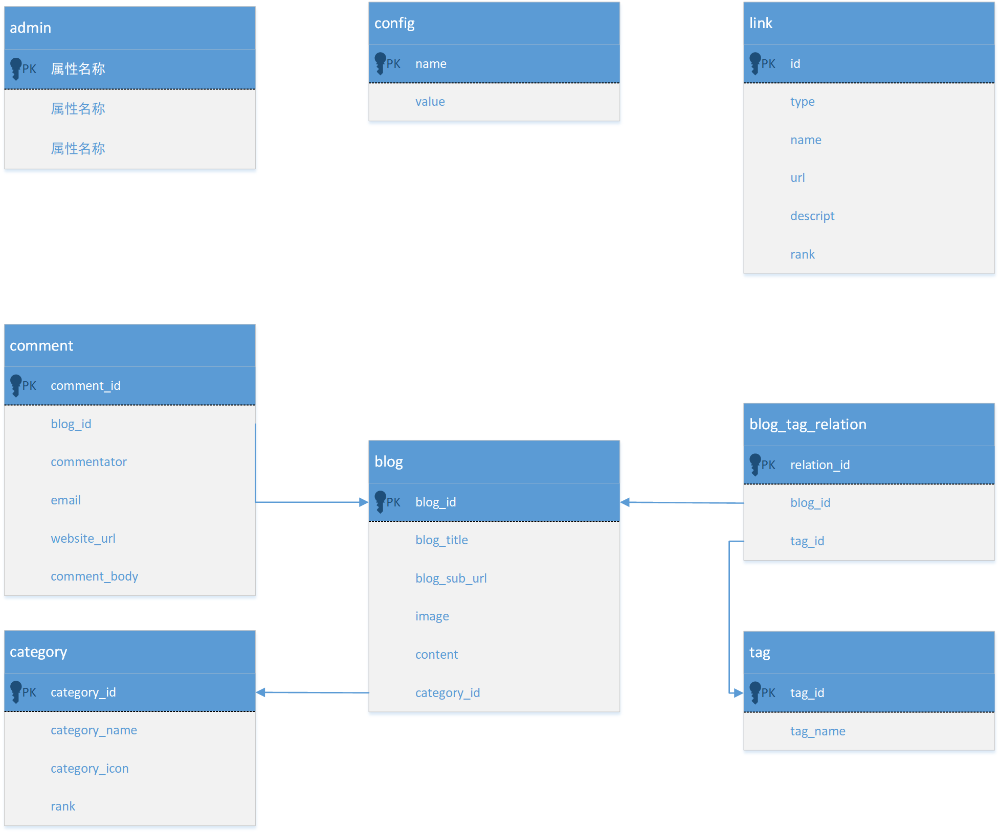
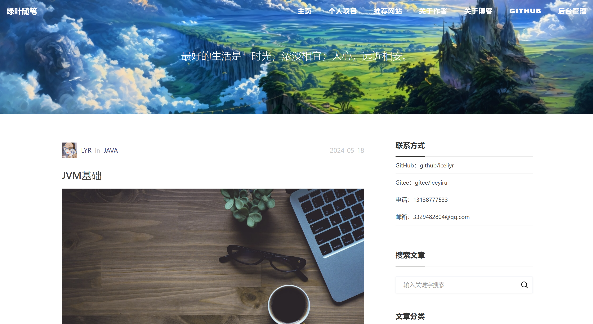
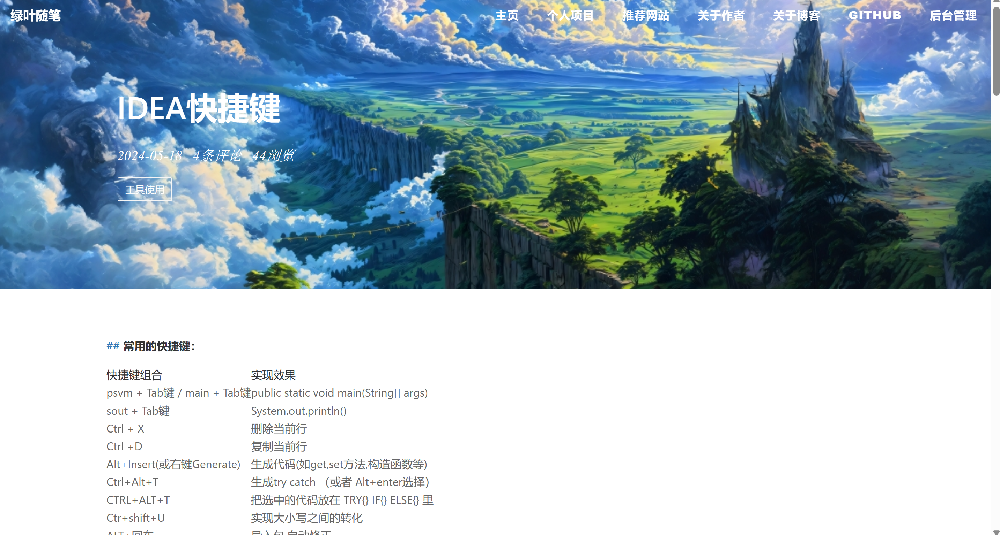
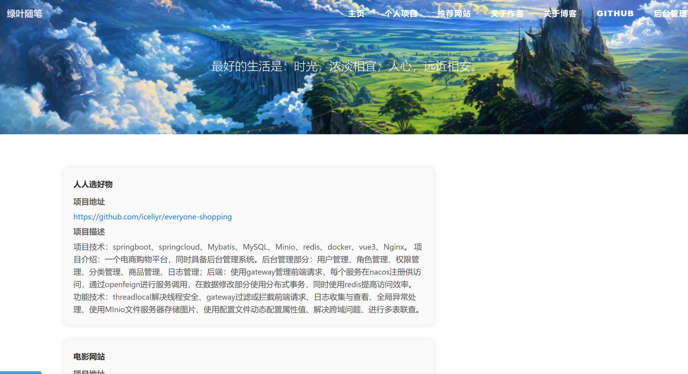
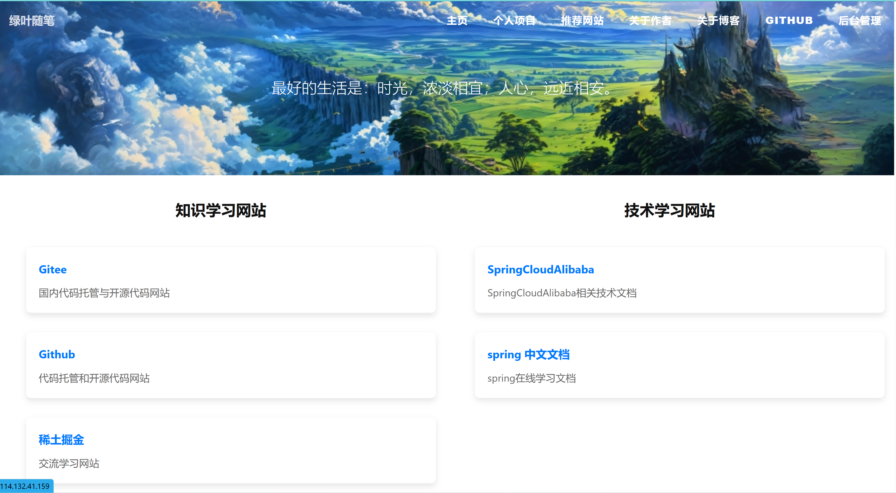
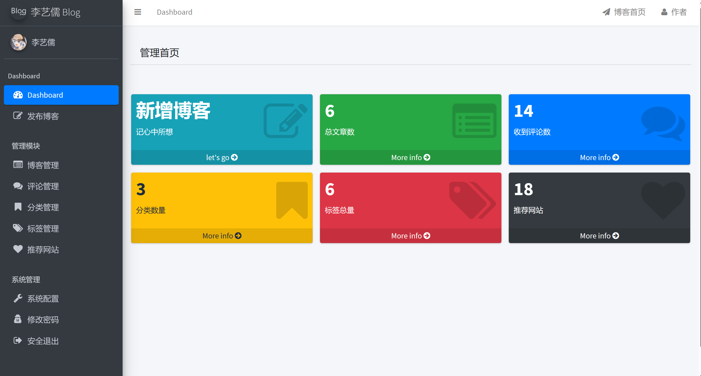
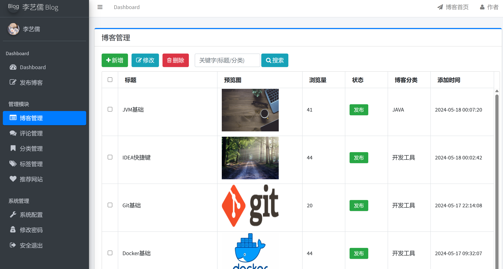
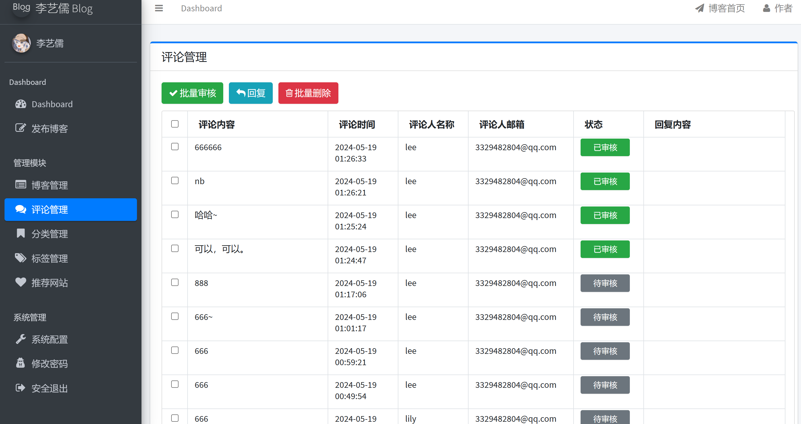
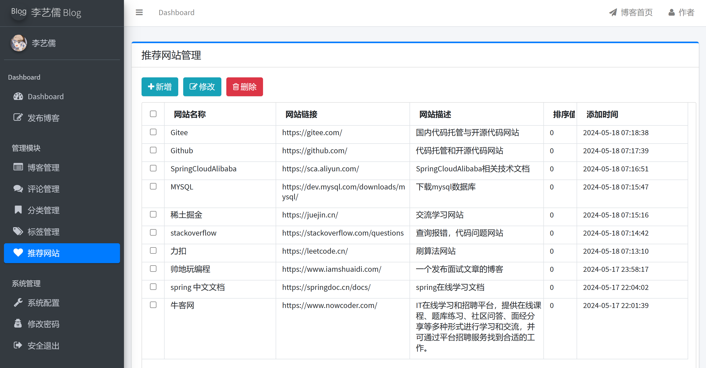

### 项目环境

**后端**

JDk17、Springboot3.1.0、Mybatis-plus3.5.3.1、Mysql.5.7.36

**前端**

Thymeleaf、Bootstrap、Jquery、AJax

### 项目地址

http://114.132.41.159/

### 项目介绍

本项目为个人博客系统，功能包括文章发布、文章分类、文章标签、文章评论、个人项目介绍、学习网站推荐、作者介绍、后台管理（文章、评论、网站管理）等功能；

### 项目功能

#### 后台登录

使用拦截器拦截后台请求，只有通过前端传入账号密码及通过（hutool工具）验证码验证后，方可进入后台管理界面进行处理数据

#### 文章发布、分类、标签

后台管理使用md编写评论，使用Atlassian CommonMark 库，用于解析和处理 Markdown 格式的文本，并保存到数据库，然后在转化为html文本块，其中涉及到图片上传功能（将图片通过javaIO保存到本地，并保存地址到数据库，前端通过接口访问地址即可获得），功能还使用了图片封面上传、文章分类、文章标签（通过多表连接）

#### 评论添加、审核、发布

在文章上添加评论，通过文章id与评论连接，在每次访问评论后，通过多表连接，获取文章的每一个评论显示

#### 学习网站推荐的发布

后台管理发布信息，并添加分类，然后保存到数据库。

### 项目未来计划

#### 阶段一：使用sa-token进行权限验证，便于游客查阅后台管理

#### 阶段二：使用redis，提高访问效率

#### 阶段三：增加社区功能，方便用户交流

#### 阶段四：使用spring cloud升级项目

### 数据库关系图

### 项目演示图片

**主页**

**详情页**

**个人项目介绍页**

**学习网站推荐页**

**后台管理页**

**博客管理页**

**评论管理**

**推荐网站管理******